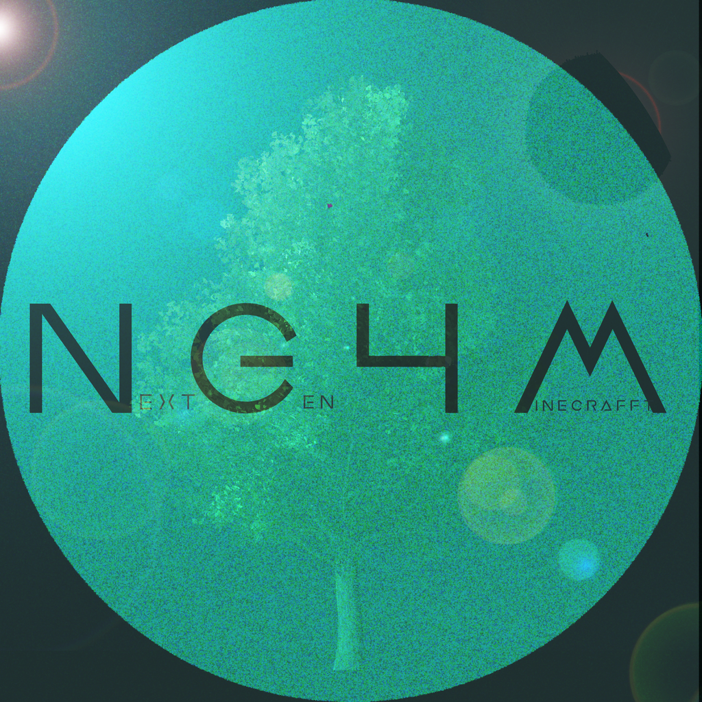

<h1 align="center">Next Gen 4 Minecraft Launcher</h1>
<h4 align="center">Fork de <a href="https://github.com/dscalzi/HeliosLauncher">Helio Launcher</a></h4>

## Téléchargement

Vous pouvez télécharger le Launcher à partir des [Releases GitHub](https://github.com/NercoriaMc/NG4MLauncher/releases)

#### Dernière Release

#### Plateforme Supporté

| Plateforme | Fichier                                              |
| -------- |------------------------------------------------------|
| Windows x64 | `NextGen4Minecraft-Launcher-setup-VERSION.exe`       |
| macOS x64 | `NextGen4Minecraft-Launcher-setup-VERSION.dmg`       |
| macOS arm64 | `NextGen4Minecraft-Launcher-setup-VERSION-arm64.dmg` |
| Linux x64 | `NextGen4Minecraft-Launcher-setup-VERSION.AppImage`  |

---

### À bientôt en jeu.